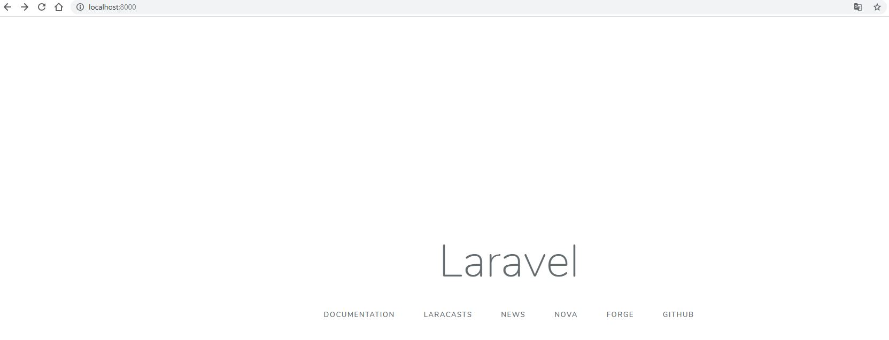

# Intranet

Sistema desenvolvido em PHP com o framework Laravel 5.7.\* e PHP 7.2

## Requisitos
 - Docker
 - Git
 - Composer

## Configuração do repositório e dependências

Utilizando o Git para baixar o app e os arquivos de configuração

### Clone esse repositório

```bash
git clone https://github.com/feeh27/intranet.git
cd intranet
```

### Instale as dependências com Composer

```bash
cd html/app
composer install
```

### Arquivos `.env`

Procure pelo arquivo `.env.intranetlocal` na raiz do projeto e no diretório `html/app` e renomeie para `.env`.

Esse arquivo é responsável pelas configurações de ambiente, como dados de acesso ao banco de dados, variáveis de ambiente, etc. 

## Docker

O tutorial abaixo utiliza o `docker-compose` para configurar os serviços de aplicativos

### Instalação do docker

#### [Docker for Mac](https://docs.docker.com/docker-for-mac/)

#### [Docker for Windows](https://docs.docker.com/docker-for-windows/)

#### [Docker for Linux](https://docs.docker.com/engine/installation/linux/)

### Docker Compose

Docker Compose é o orquestrador de containers da Docker.

Comando `docker-compose` para construir & executar:

```bash
docker-compose up --build -d
```

Acesse [http://localhost:8000](http://localhost:8000) e você verá algo como abaixo:



Caso o resultado seja parecido com a imagem acima sua configuração foi um sucesso!

### Mais comandos `docker-compose`

Alguns dos outros comandos do `docker-compose`

#### Lista os containers dessa aplicação

```bash
docker-compose ps
```

#### Para os containers dessa aplicação

```bash
docker-compose stop
```

#### Para e remove os containers dessa aplicação

```bash
docker-compose down
```

#### Acessa o terminal do container php

```bash
docker container exec -it intranet_php_1 bash
```

### Arquivo `php.ini` customizado

Para setar diretivas PHP você pode utilizar o arquivo `php.ini` customizado, ele se encontra no diretório `docker/php/php-ini`

## Laravel

Para criação do site estamos utilizando o Framework Laravel, versão 5.7

### Migrations and Seeds

Para que seu ambiente seja configurado corretamente é necessário migrar(criar a estrutura) e semear(inserir dados) as tabelas.

<b>Atenção: </b>Antes de executar os comandos, verifique se você está em `laravel/html/app`, caso contrário o comando não irá funcionar

Migrando as tabelas:

```bash
php artisan migrate
```

Semeando as tabelas com dados para teste:

```bash
php artisan db:seed
```

Para inserir novos dados para semear o sistema na instalação, basta alterar o arquivo `DatabaseSeeder.php` que fica no diretório `app/database/seeds`.

### Documentações

 - Instalação: [https://laravel.com/docs/5.7](https://laravel.com/docs/5.7)
 - Configuração de ambientes: [https://laravel.com/docs/5.7/configuration](https://laravel.com/docs/5.7/configuration)

### Tutoriais

 - Autenticação: [https://medium.com/@sayhicoelho/laravel-5-4-trabalhando-com-autentica%C3%A7%C3%B5es-independentes-sem-packages-adicionais-6e50c11a0b79](https://medium.com/@sayhicoelho/laravel-5-4-trabalhando-com-autentica%C3%A7%C3%B5es-independentes-sem-packages-adicionais-6e50c11a0b79)

### Cursos
 
 - Udemy - Repositories: [https://www.udemy.com/repositories-laravel-abstracao-de-logica](https://www.udemy.com/repositories-laravel-abstracao-de-logica)
 - Udemy - Observers: [https://www.udemy.com/laravel-eventos-observers](https://www.udemy.com/laravel-eventos-observers)
 - Udemy - Laravel 5.6 Completo: [https://www.udemy.com/laravelcompleto](https://www.udemy.com/laravelcompleto)

## Testes com PHP Unit
Por padrão o Lumen / Laravel possuem integração com o PHP Unit.
PHP Unit é uma ferramenta para testes e sua utilização é simples, basta criar um novo arquivo para testes na pasta `html/app/tests`, esse arquivo deve ser uma classe e extender `TestCase`.

### Documentação 
 - Oficial do Lumen: [https://laravel.com/docs/5.7/testing](https://laravel.com/docs/5.7/testing)

### Tutoriais
 - Testes básicos: [https://medium.com/stephenjudesuccess/testing-lumen-api-with-phpunit-tests-555835724b96](https://medium.com/stephenjudesuccess/testing-lumen-api-with-phpunit-tests-555835724b96)
 
### Comando para executar testes
```bash
php vendor/phpunit/phpunit/phpunit;
```

## Como trabalhar com Git no projeto
Atualmente o repositório conta com três branchs principais, a branch 'MASTER', que remete ao projeto que está rodando em produção, a branch 'HOMOLOG', que remete ao projeto que está em fase de homologação e a branch 'DEVELOP', que remete ao projeto que está em fase de desenvolvimento. NUNCA devemos commitar diretamente em nenhuma das branches, para minimizar os conflitos e usufruirmos de todas as vantagens do git, vamos utilizar o seguinte workflow:


De acordo com o modelo, também existem duas branches principais(develop e master), uma branch para as features e outra de release. Seguindo esse modelo temos os passos:

1. Entre na branch de desenvolvimento:
    >git checkout develop

2. Atualize a branch develop para evitar conflitos futuros:
    >git pull origin develop

3. Entre na branch que representa uma nova feature a ser desenvolvida:
    >git checkout -b feature/TAREFA-A-SER-DESENVOLVIDA

4. Atualize e adicione essa branch ao repósito remoto
	>git push origin feature/TAREFA-A-SER-DESENVOLVIDA

5. Faça um link entre o repositório local e o repositório remoto
	>git branch --set-upstream-to=origin/<feature/TAREFA-A-SER-DESENVOLVIDA> <feature/TAREFA-A-SER-DESENVOLVIDA>

6. Desenvolva as tarefas, faça todos os commits da tarefa nessa nova branch e após todo commit sempre atualize o repositório remoto com o comando push do passo 4

7. Após finalizar a tarefa, precisamos fazer um pull request de tudo o que foi feito, para isso vamos juntar tudo o que acaba de ser desenvolvido com a branch `develop`, pelo site do GitHub faça um pull request da branch `feature/TAREFA-A-SER-DESENVOLVIDA` para a branch `develop` e delete a branch `feature/TAREFA-A-SER-DESENVOLVIDA` após o merge via pull request

8. Iremos sincronizar as branchs locais com as remotas e atualizaremos a branch `develop`:
	>git fetch origin --prune
	
    >git checkout develop
    
    >git pull

9. Com o develop atualizado e os conflitos resolvidos já podemos entrar na nossa branch local `homolog`, sincronizá-la com o repositório remoto, fazer o merge com a branch `develop` e atualizar o repositório remoto
    >git checkout homolog
    
    >git pull
    
    >git merge --no-f develop
    
    >git push origin homolog

10. Com a branch `homolog` atualizada, os devidos testes devem ser feitos e após aprovação dos testes já podemos entrar na nossa branch local `master`, sincronizá-la com o repositório remoto e fazer o merge com a branch `homolog`
    >git checkout master
    
    >git pull
    
    >git merge --no-f homolog

12. Iremos atualizar o tageamento, para mais informações sobre quais números colocar sobre a versão, consulte o link abaixo que explica o que é o versionamento semântico:
    >https://semver.org/lang/pt-BR/

13. Atualize o arquivo `CHANGELOG.md` seguindo as regras de tageamento e com as informações de alteração, após finalizar as alterações no arquivo faça o commit. Obs.: Esse arquivo deve estar somente na branch master

14. Podemos atualizar agora o repositório remoto
    >git push origin master

15. Por fim podemos realizar o tagueamento indicando que o projeto está em uma nova uma versão. IMPORTANTE: não faz sentido taguear nossa branch `develop` e nem a branch `homolog`, somente a branch `master`, que representa o código em produção. Portanto dentro da branch master fazemos o tagueamento
    >git tag v1.0.0 -m 'DESCRIÇÃO DO TAGUEAMENTO'


16. Agora podemos atualizar o tagueamento no repositório remoto:
    >git push origin master --tags

O processo acima deve ser repetido para todas as tarefas que serão desenvolvidas no sistema.

### Alguns comandos git que são úteis e que não foram listados acima:

1. Deletar tag local (antes do push):
	>git tag -d vX.X.X

2. Deletar branch:
	>git branch -D branch-a-ser-deletado

3. Lista dos arquivos criados, alterados e excluídos:
	>git status

4. Adicionar arquivos para commit:
	>git add -A

5. Reverter git add -A:
	>git reset HEAD

6. Fazer um commit:
	>git commit

7. Reverter alterações feitas nos arquivos (isso reverter as alterações dos arquivos alterados e que não foi feito o commit):
	>git checkout -- .
