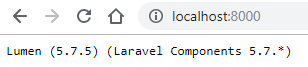

# Intranet API - Lumen

Sistema desenvolvido em PHP com o microframework Lumen 5.7.5 (Laravel Componentes 5.7.\*) e PHP 7.2

## Requisitos
 - Docker
 - Git
 - Composer

## Configuração do repositório e dependências

Utilizando o Git para baixar o app e os arquivos de configuração

### Clone esse repositório

```bash
git clone https://github.com/feeh27/intranet.git
cd intranet
```

### Instale as dependências com Composer

```bash
cd html/app
composer install
```

### Arquivos `.env`

Procure pelo arquivo `.env.tagchopplocal` na raiz do projeto e no diretório `html/app` e renomeie para `.env`.

Esse arquivo é responsável pelas configurações de ambiente, como dados de acesso ao banco de dados, variáveis de ambiente, etc. 

## Docker

O tutorial abaixo utiliza o `docker-compose` para configurar os serviços de aplicativos

### Instalação do docker

#### [Docker for Mac](https://docs.docker.com/docker-for-mac/)

#### [Docker for Windows](https://docs.docker.com/docker-for-windows/)

#### [Docker for Linux](https://docs.docker.com/engine/installation/linux/)

### Docker Compose

Docker Compose é o orquestrador de containers da Docker.

Comando `docker-compose` para construir & executar:

```bash
docker-compose up --build -d
```

Acesse [http://localhost:8080](http://localhost:8080) e você verá algo como abaixo:



Caso o resultado seja parecido com a imagem acima sua configuração foi um sucesso!

### Mais comandos `docker-compose`

Alguns dos outros comandos do `docker-compose`

#### Lista os containers dessa aplicação

```bash
docker-compose ps
```

#### Para os containers dessa aplicação

```bash
docker-compose stop
```

#### Para e remove os containers dessa aplicação

```bash
docker-compose down
```

#### Acessa o terminal do container php

```bash
docker container exec -it intranet_php_1 bash
```

### Arquivo `php.ini` customizado

Para setar diretivas PHP você pode utilizar o arquivo `php.ini` customizado, ele se encontra no diretório `docker/php/php-ini`

## Lumen / Laravel

Para criação da API estamos utilizando o Framework Lumen, versão 5.7.1

### Migrations and Seeds

Para que seu ambiente seja configurado corretamente é necessário migrar(criar a estrutura) e semear(inserir dados) as tabelas.

<b>Atenção: </b>Antes de executar os comandos, verifique se você está em `intranet/html/app`, caso contrário o comando não irá funcionar

Migrando as tabelas:

```bash
php artisan migrate
```

Semeando as tabelas com dados para teste:

```bash
php artisan db:seed
```

Para inserir novos dados para semear o sistema na instalação, basta alterar o arquivo `DatabaseSeeder.php` que fica no diretório `app/database/seeds`.

### Documentações

 - Instalação: [https://lumen.laravel.com/docs/5.7/installation](https://lumen.laravel.com/docs/5.7/installation)
 - Configuração de ambientes: [https://lumen.laravel.com/docs/5.7/configuration](https://lumen.laravel.com/docs/5.7/configuration)
 - Autorizações: [https://lumen.laravel.com/docs/5.7/authorization](https://lumen.laravel.com/docs/5.7/authorization)
 - Autenticação JWT: [https://github.com/tymondesigns/jwt-auth](https://github.com/tymondesigns/jwt-auth)

### Tutoriais

 - Restful API: [https://auth0.com/blog/developing-restful-apis-with-lumen/](https://auth0.com/blog/developing-restful-apis-with-lumen/)
 - Repositories: [https://medium.com/by-vinicius-reis/repository-pattern-n%C3%A3o-precisa-ser-chato-principalmente-com-laravel-d97235b31c7e](https://medium.com/by-vinicius-reis/repository-pattern-n%C3%A3o-precisa-ser-chato-principalmente-com-laravel-d97235b31c7e)
 - Repositories: [https://blog.schoolofnet.com/2015/07/trabalhando-com-repository-no-laravel/](https://blog.schoolofnet.com/2015/07/trabalhando-com-repository-no-laravel/)
 - Repositories: [https://medium.com/employbl/use-the-repository-design-pattern-in-a-laravel-application-13f0b46a3dce](https://medium.com/employbl/use-the-repository-design-pattern-in-a-laravel-application-13f0b46a3dce)
 - Seeds: [https://medium.com/by-vinicius-reis/trabalhando-com-seeds-no-laravel-5-142829ddc32e](https://medium.com/by-vinicius-reis/trabalhando-com-seeds-no-laravel-5-142829ddc32e)
 - Observers: [https://quickadminpanel.com/blog/log-your-laravel-model-data-changes-with-observers/](https://quickadminpanel.com/blog/log-your-laravel-model-data-changes-with-observers/)
 - Observers: [https://bosnadev.com/2014/12/28/laravel-model-observers/](https://bosnadev.com/2014/12/28/laravel-model-observers/)
 - Autenticação Pt1: [https://ngide.net/posts/membuat-rest-api-dengan-lumen-authentication-dengan-jwt-auth](https://ngide.net/posts/membuat-rest-api-dengan-lumen-authentication-dengan-jwt-auth)
 - Autenticação Pt2: [https://github.com/tymondesigns/jwt-auth/issues/967#issuecomment-419758798](https://github.com/tymondesigns/jwt-auth/issues/967#issuecomment-419758798)
 - Exportar para diversos formatos: [https://github.com/nathanmac/Parser](https://github.com/nathanmac/Parser)
 - Permissões: [https://code.tutsplus.com/tutorials/gates-and-policies-in-laravel--cms-29780](https://code.tutsplus.com/tutorials/gates-and-policies-in-laravel--cms-29780)
 - Canal Laravel: [https://www.youtube.com/channel/UC0Da9RonsYYqh2WK_m61t2g](https://www.youtube.com/channel/UC0Da9RonsYYqh2WK_m61t2g)
 - ACL: [https://www.youtube.com/watch?v=-AVa6GNpEL8&list=PLVSNL1PHDWvTch1r8uTSluw9SkzSA9cDJ](https://www.youtube.com/watch?v=-AVa6GNpEL8&list=PLVSNL1PHDWvTch1r8uTSluw9SkzSA9cDJ)

### Cursos
 
 - Udemy - Repositories: [https://www.udemy.com/repositories-laravel-abstracao-de-logica](https://www.udemy.com/repositories-laravel-abstracao-de-logica)
 - Udemy - Observers: [https://www.udemy.com/laravel-eventos-observers](https://www.udemy.com/laravel-eventos-observers)
 - Udemy - Laravel 5.6 Completo: [https://www.udemy.com/laravelcompleto](https://www.udemy.com/laravelcompleto)

## Testes com PHP Unit
Por padrão o Lumen / Laravel possuem integração com o PHP Unit.
PHP Unit é uma ferramenta para testes e sua utilização é simples, basta criar um novo arquivo para testes na pasta `html/app/tests`, esse arquivo deve ser uma classe e extender `TestCase`.

### Documentação 
 - Oficial do Lumen: [https://lumen.laravel.com/docs/5.7/testing](https://lumen.laravel.com/docs/5.7/testing)

### Tutoriais
 - Testes básicos: [https://medium.com/stephenjudesuccess/testing-lumen-api-with-phpunit-tests-555835724b96](https://medium.com/stephenjudesuccess/testing-lumen-api-with-phpunit-tests-555835724b96)
 
### Comando para executar testes
```bash
php vendor/phpunit/phpunit/phpunit;
```
